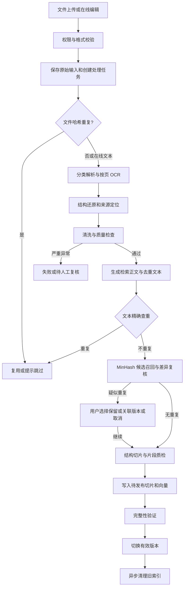

# RAG 数据预处理完整方案

> 日期：2026-09-11  
> 适用项目：langchain-rag 企业内部知识库问答系统  
> 文档性质：设计方案，不包含业务代码修改。下述目录、字段、接口和状态除明确标为现状外，均为建议设计。参数属于初始实验配置，须经真实数据验证。

## 1. 目标与范围

建立统一的数据导入流水线，将文件、扫描件和在线编辑内容转换成可检索、可引用、可重建的知识片段。

核心目标：

1. 正确解析文本 PDF、扫描 PDF、混合 PDF、图片、Markdown、TXT、CSV，以及按阶段接入的 DOCX、代码和 PPTX。
2. 保留标题、段落、表格及来源位置，避免简单拼接全文造成结构丢失。
3. 通过文件哈希、文本哈希、MinHash 近似查重减少重复导入，同时保留关键差异和版本关系。
4. 通过质量检查阻止乱码、空内容和严重 OCR 错误进入有效索引。
5. 支持异步处理、人工复核、幂等重试和新旧索引安全切换。
6. 用真实问题的检索效果衡量质量，而不只看上传成功率。

本方案涵盖上传前检查到索引发布的全过程。混合检索、重排序、问句改写属于后续检索优化；本期仅规定检索必须遵守有效版本、权限和来源约束。

## 2. 项目现状与缺口

当前调用链：

`KnowledgeService.uploadDocument → extractText → 合并 pageContent → createDocument → RagService.indexDocument → 字符切片 → 向量写入 → 业务切片入库`

| 当前实现 | 缺口及影响 |
| --- | --- |
| PDF 以 `splitPages: false` 加载，所有 Loader 结果再次拼接 | 页码和行级元数据未传到切片 |
| CSV 每行加载后合并成全文 | 记录边界可能被切断 |
| Markdown 与普通文本同样读取 | 标题、表格和代码块没有专用处理 |
| 前端允许 DOCX、PPTX，后端没有对应解析分支 | 二进制文件可能按 UTF-8 读取 |
| 提取内容为空时回退为 `buffer.toString("utf-8")` | 扫描件可能变为乱码入库 |
| 固定 500 字符、50 字符重叠 | 未区分内容结构；并非真正语义切片 |
| `tokenCount` 使用字符长度除以 2 | 是估算值，不能保证模型输入不超限 |
| 索引错误被捕获后返回空数组 | 文档仍可能显示正常，但不可检索 |
| 更新先删旧切片和旧向量 | 重建失败会失去可用索引 |
| 业务切片与向量表分别写入 | 缺少稳定关联及失败恢复机制 |
| 正文接口通过重叠切片拼接内容 | 预览可能重复，不能作为原文 |
| 原始文件只暂存，处理后删除 | 无法直接重新 OCR 或重解析 |
| 向量检索仅按知识库 ID 过滤 | 需要补充有效版本、业务状态与权限约束 |

代码已实现 pgvector 向量检索，`docs/rag-knowledge-retrieval.md` 中的早期关键词检索方案不能作为当前实现依据。默认 embedding 配置为 Ollama 的 `qwen3-embedding:0.6b`，可通过环境变量替换；输入限制、分词方式和向量维度应以实际部署配置验证。

## 3. 总体流程

上传、新建和编辑共用清洗、查重、切片、索引发布流程。编辑已有文档属于新版本处理，不因为命中自己的旧版本就自动取消更新。只改名称等展示信息不必重新生成 embedding，但应同步引用信息或在检索时读取最新名称。

## 4. 输入校验与原始数据管理

### 4.1 上传校验

- 服务端校验文件存在、大小、允许格式，并结合 MIME、文件签名或可解析性判断真实格式。纯文本不能仅凭文件签名判定。
- 统一前后端支持列表。50 MB 可作为延续当前产品文案的初始上限，服务端必须实际执行；同时配置页数、解压后大小、解析耗时和 OCR 并发限制。
- 对加密、损坏、空文件返回可理解的错误；不将无法解析的二进制内容回退为文本。
- 临时路径使用系统生成的唯一标识，不直接拼接用户文件名。
- 处理及查重前验证用户对目标知识库的权限。

### 4.2 原始输入保存

原文件保存在存储适配层：开发阶段可使用受控本地目录，部署时接入持久对象存储。数据库保存存储键和元数据，避免保存临时路径作为长期引用。

分别记录原始文件字节数和解析文本字节数。在线编辑内容同样保存为不可变的版本输入。保存期限与业务删除策略一致；删除原文件前确认没有仍依赖它的版本或来源关系。

### 4.3 文件级精确去重

对原始字节计算 SHA-256，限定在同一知识库内查询。相同文件且已有可用版本时可复用；若已有记录处理失败，则提供重试或继续已有任务，而不是简单跳过。

对并发上传设置唯一约束或等效的幂等控制，避免“先查询后写入”导致重复任务。跨知识库可在存储层复用物理文件，但业务记录、权限和来源必须独立；第一期不做跨知识库内容查重。

## 5. 分类解析与扫描件 OCR

### 5.1 各格式的输出策略

| 类型 | 解析策略 | 必须保留的来源 |
| --- | --- | --- |
| TXT | 显式处理编码，提取段落；乱码时阻断或要求确认 | 段落、行号或字符范围 |
| Markdown | 解析标题、列表、表格、代码块 | 标题路径、行号 |
| 文本 PDF | 按页提取，结合版面恢复阅读顺序 | 页码、可用时的坐标 |
| 扫描 PDF | 渲染页面后 OCR | 页码、坐标、识别信息 |
| 混合 PDF | 按页或区域选择文本提取与 OCR | 页码、区域、解析方式 |
| 图片 | 方向与质量处理后 OCR | 图片标识和坐标 |
| CSV | 显式处理编码、分隔符和带引号字段；保留每条记录 | 行号、列名、业务标识 |
| DOCX | 专用解析器处理标题、段落和表格 | 标题、段落、表格位置；未渲染时不承诺稳定页码 |
| 代码 | 保留语言、函数或类及注释 | 文件名、符号、行号 |
| PPTX | 按幻灯片提取文本及表格，图片按需 OCR | 幻灯片编号、元素位置 |

解析器只负责提取及结构识别，不写业务数据库，不直接调用向量库。

### 5.2 OCR 路由判断

不能只判断“是否提取到文本”。每页综合检查有效文字量、可打印字符比例、乱码、图片覆盖情况和正文区域。只有页码、水印或劣质隐藏文本层的页面，仍可能需要 OCR。

同一页面文本层与 OCR 区域合并时，应按位置和内容消除重叠，避免正文被重复提取。不要对所有 PDF 无条件全量 OCR。

### 5.3 OCR 子流程

1. 渲染页面并记录分辨率、方向和坐标转换关系。
2. 按需执行旋转、倾斜校正、适度去噪和对比度调整；保留原图，不覆盖原始文件。
3. 识别文字及区域，获取引擎能提供的置信度。
4. 恢复多栏阅读顺序、段落、标题及表格结构。
5. 对页眉、页脚和水印做跨页一致性判断。
6. 进行质量检查，输出通过、警告或待复核结果。

数字、日期、金额、单位、编号和否定词不得基于上下文擅自猜改。手写、盖章遮挡、复杂表格等无法可靠识别的内容应明确标记。

不同 OCR 引擎的置信度不可直接共用同一个数值阈值。需要结合具体引擎校准；没有置信度时不能伪造分数。原页坐标应注明坐标原点、单位、页面尺寸、旋转信息，便于正确高亮。

### 5.4 OCR 接入方式

通过统一适配接口接入一个首选 OCR 引擎，避免业务逻辑绑定供应商。先用真实样本比较中文、数字、表格、速度和部署条件，再决定引擎，不在本方案中假定具体产品能力。

OCR 是耗时任务，交给后台 Worker，支持逐页进度、超时、有限重试和断点复用。完整文档默认全部必需页面通过才发布；若未来允许部分页面发布，必须明确展示缺失页并提供产品配置。

## 6. 统一中间结构

不要把 Loader 的结果立即合并成字符串。建议使用以下三层中间产物：

| 层次 | 关键内容 |
| --- | --- |
| ParsedDocument | 文档版本、格式、解析器版本、页面或内容块、解析告警 |
| ContentBlock | 块 ID、类型、原始文本、规范化文本、标题路径、顺序、来源位置、OCR 信息 |
| PreparedChunk | 稳定切片 ID、正文、embedding 输入、块引用、序号、来源范围、哈希、token 信息 |

块类型包括标题、段落、列表、表格、代码、图片识别文本等。原始提取文本与清洗文本分开保存；清洗及合并后继续保留源块引用，不能用清洗后的字符偏移假装原文件位置。

数据量小时，内容块可作为版本的结构化 JSON 产物保存；只有需要独立查询、编辑或大量块级任务时才拆专表。

## 7. 清洗与质量控制

### 7.1 清洗规则

- 统一换行，去除 BOM、无效控制字符和明确异常的空白。
- 根据块类型处理空格和换行，保留代码缩进、列表层级、Markdown 表格结构。
- PDF 错误断行和连字符修复采用保守规则，保留清洗记录。
- 重复页眉页脚结合跨页频次及位置识别，不仅靠词语匹配。
- 表格保留表头、单位和上下文，无法可靠恢复时提供原页引用并告警。
- 不全局删除标点、停用词、数字、版本号和否定词；不默认执行繁简转换或全文大模型改写。
- 如业务要求脱敏，单独配置字段规则并保留受控原文；不把脱敏混入去重而失去差异。

### 7.2 两种文本表示

**检索正文**保留有意义的结构与信息，用于切片、引用和回答。

**去重文本**可额外规范化无意义空白、已确认的页眉页脚等。记录规范化版本，不能将不同规则计算出的哈希和签名直接混用。去重文本仍保留关键数字、日期、条款编号及否定词。

### 7.3 质量闸门

| 检查阶段 | 检查内容 | 处理方式 |
| --- | --- | --- |
| 解析后 | 空结果、乱码、缺页、读取顺序异常 | 严重问题失败或待复核 |
| OCR 后 | 低质量区域、关键字段识别疑点 | 标记页面和区域供人工检查 |
| 清洗后 | 文本异常缩短、大量块被删除 | 保存对比并暂停发布 |
| 切片后 | 空块、超长块、来源缺失、表头丢失 | 修复、重新切片或阻断 |
| 索引发布前 | 数量、ID、模型维度和版本一致性 | 不完整则不切换版本 |

阈值按文件类型配置，通过样本确定。短文档和空白页不应仅因字符少就判为失败。质量告警与阻断错误分开，用户能知道问题位置及可执行的解决办法。

## 8. 文档去重设计

### 8.1 三层查重

1. 文件 SHA-256：解析前查重，节省 OCR 和解析成本。
2. 规范化文本 SHA-256：解析后查重，识别不同格式但正文一致的文档。
3. MinHash 候选召回和精确复核：识别增删少量文字、排版差异及部分 OCR 误差造成的相似文本。

完全重复也要保留业务来源。是否复用已有文档取决于知识库、权限、有效版本及用户操作，不因哈希相同就跨范围删除记录。

### 8.2 MinHash 与 SimHash 的取舍

| 算法 | 比较方式 | 本项目的定位 |
| --- | --- | --- |
| MinHash | 对文本 shingles 集合生成签名，近似估计 Jaccard 相似度 | 第一阶段近似去重方案 |
| SimHash | 对带权特征生成位指纹，通过汉明距离筛选 | 可选对照方案，暂不双轨实现 |

MinHash 适合围绕文本片段重合度构建候选和复核流程。它衡量词面片段重合，不等同于语义相似。SimHash 也不是直接判断文档业务等价的工具；汉明距离不能直接展示成百分比相似度。

### 8.3 MinHash 处理步骤

1. 获取版本化的去重文本。
2. 生成连续字符 shingles，中文优先以字符级方案进行实验。
3. 固定哈希种子、算法和签名长度，生成 MinHash 签名。
4. 小规模数据可在同一知识库内比较签名；规模增长后增加 LSH 分桶候选索引。
5. 对候选计算精确 shingle Jaccard、长度比例、双向覆盖率，并比较关键字段及段落差异。
6. 保存候选关系、分数类型、差异证据和用户决定。

实验可比较字符 shingle 长度 3、5、7，以及签名长度 128、256；这些不是上线结论。较短片段和较长片段对局部改动的敏感性不同，应对扫描件单独评估。极短文本不足以生成片段时退回精确比较或专门短文本规则。

LSH 的分桶数和每桶签名数需结合候选召回率、误报率和延迟调参。LSH 属于概率候选筛选，不能保证找出所有重复文档；最终阈值也不能直接代替分桶参数。不要用新旧版本不一致的签名进行比较。

### 8.4 精确复核与包含关系

对 shingle 集合 A、B：

- Jaccard：`|A ∩ B| / |A ∪ B|`。
- A 被 B 覆盖的比例：`|A ∩ B| / |A|`。
- B 被 A 覆盖的比例：`|A ∩ B| / |B|`。

空集合需单独处理。短文档被长文档完整包含时，Jaccard 可能偏低，而且文档级 LSH 可能根本没有召回该候选。若需要可靠发现汇编包含关系，应增加段落或章节级候选召回，再聚合文档覆盖率，而不是只在已有候选上补算覆盖率。

### 8.5 决策策略

| 情况 | 默认处理 |
| --- | --- |
| 同文件、已有可用版本 | 提示已存在，可复用或跳过 |
| 文本完全相同 | 提示内容重复，保留必要的来源关联 |
| 高度相似 | 待复核，展示候选和差异 |
| 同一制度的新旧版本 | 关联版本，允许显式发布新版 |
| 长短文档包含关系 | 标记关系，保留独立文档 |
| 同模板、不同业务字段 | 保留独立文档 |
| 编辑文档命中自身旧版本 | 展示变更，按更新流程处理 |

例如“住宿报销上限 500 元”改为“600 元”，即使全文高度相似，也不能自动去重。第一期近似重复只提示，不自动删除或合并。全局切片去重同样暂不做，避免丢失出处；embedding 缓存与业务来源去重是两回事。

### 8.6 指纹存储

每个文档版本保存文件哈希、文本哈希、规范化版本、指纹算法版本、字符片段参数、签名参数与签名。LSH 桶单独存储知识库、算法版本、桶号、桶键、版本 ID，并建立组合索引。

候选关系保存双方版本 ID、各类分数、差异证据及处理结论。文档内容更新后结论绑定旧版本，不自动沿用到新内容。删除或权限变更后同步维护候选索引和访问限制。

## 9. 结构化切片

### 9.1 总体规则

先按结构组织，再控制长度。现有递归字符切片器保留为兜底。500 字符、50 字符重叠保留为实验基线，不作为所有格式固定规则。

| 内容 | 规则 |
| --- | --- |
| 制度及说明 | 按标题、条款、段落组织，保持例外条件与相关条款相邻 |
| Markdown | 按标题层级组织，尽量保持列表和代码围栏完整 |
| CSV | 每条记录携带列名及业务标识，不盲目跨行合并 |
| 表格 | 拆分时重复表头、单位和必要行列标识 |
| 代码 | 优先函数、类及注释边界，超长再拆 |
| OCR 正文 | 遵循恢复后的阅读顺序，允许跨页连续段落并保留多页来源 |

短块只在同章节、同类型且语义连续时合并。超长表格、代码块允许拆分，但必须重复必要上下文并保留来源。相邻重叠只用于确有上下文延续的内容，不对独立 CSV 记录机械重叠。

### 9.2 正文与 embedding 输入

切片正文保存可引用的内容。embedding 输入可增加文档标题和标题路径，补充片段上下文；人工添加的上下文不能伪装成原文。两者分别记录，哈希及缓存以实际 embedding 输入为准。

使用实际模型对应的计数或可靠的长度校验机制。暂时无法获得准确 token 数时标记为估算，采用保守上限并处理模型拒绝，不将 `字符数 / 2` 标为精确 token 数。

### 9.3 切片元数据

包括知识库 ID、文档 ID、版本 ID、稳定切片 ID、序号、标题路径、源块 ID、适用的页码/坐标/行号、内容哈希、切片策略版本、模型标识和 token 计数方式。

稳定切片 ID 应包含版本及块序号等上下文，不能仅使用正文哈希，以免同文档中相同文本的不同位置互相覆盖。向量记录与业务切片共享该标识。

## 10. 数据模型建议

### 10.1 现有模型的职责

| 模型 | 建议职责 |
| --- | --- |
| KnowledgeDocument | 逻辑文档、归属、显示名称、业务状态、当前有效版本引用 |
| KnowledgeChunk | 某个版本的切片、稳定 ID、正文、来源 metadata |
| 向量表 | 与切片关联的向量、版本及过滤字段 |

`CommonStatus` 继续表示正常、归档、删除，不混入解析中、失败等处理状态。`KnowledgeChunk.metadata` 已存在，可扩展来源信息，但关键过滤字段和关联字段应有明确类型及索引。

### 10.2 建议新增的逻辑实体

| 实体 | 主要字段或职责 |
| --- | --- |
| DocumentVersion | 版本号、输入存储键、文件大小、原始文本/结构产物、清洗正文、处理配置、有效性 |
| IngestionJob | 任务状态、当前阶段、进度、重试次数、错误码、错误摘要、幂等键 |
| DocumentFingerprint | 文件/文本哈希、MinHash 签名、算法与参数版本 |
| DuplicateCandidate | 候选版本、分数、差异、决定、操作者和时间 |
| FingerprintBucket | 可选 LSH 桶索引，达到规模需要时引入 |

这些是逻辑职责，不要求第一期全部拆表；但文档版本和处理任务建议独立，避免把重试历史覆盖到文档本身。

## 11. 异步任务、幂等与索引发布

### 11.1 状态机

`QUEUED → PARSING/OCR → NORMALIZING → DEDUPLICATING → CHUNKING → EMBEDDING → PUBLISHING → READY`

旁路状态：`NEEDS_REVIEW`、`FAILED`、`CANCELLED`、`DUPLICATE_SKIPPED`。状态名为建议值，待实现时统一到共享类型。

上传返回文档、版本和任务 ID；前端查询或订阅进度。进度显示当前阶段及已处理页数/块数，未知总耗时时不伪造精确完成百分比。

### 11.2 安全重建

1. 保留旧有效版本，新建待处理版本。
2. 完成新版本解析、查重、切片及向量写入。
3. 验证业务切片与向量数量、稳定 ID 及模型配置一致。
4. 在受控发布操作中切换 `activeVersionId`，更新计数。
5. 异步清理旧版本向量，按保留策略保留原始历史内容。

任一步失败不影响旧版本可检索性。检索必须依据当前有效版本选择结果；只写一个向量 metadata 标记而未保证其与业务状态一致，不足以实现安全发布。

现有 PGVectorStore 的简单过滤若不能表达有效版本和权限约束，需要扩展检索适配层，例如用受控 SQL 关联业务版本状态。不能把少量 top-K 取出后简单过滤就当成完整解决方案，因为可能过滤后没有足够结果。

### 11.3 重试与一致性

- 幂等键包含版本 ID 和流水线配置版本；切片/向量写入使用稳定 ID，支持安全重复执行。
- 同一版本只允许一个有效执行者；使用锁或租约避免并发 Worker 重复发布。
- 同一逻辑文档并发更新时，通过版本检查避免较旧任务覆盖较新发布结果。
- 临时网络、限流和 OCR 服务错误有限次数退避重试；格式损坏等永久错误直接给出原因。
- Worker 崩溃可通过租约超时恢复，复用已完成的页面和中间产物。
- 数据库事务不能自动覆盖独立的向量写入调用；通过待发布版本、完整性检查和补偿清理实现恢复。
- 检查取消或删除状态后再发布，防止文档删除后后台任务重新激活索引。
- 文档/知识库删除立即影响检索可见性，物理向量清理可重试异步执行。
- 计数只在有效版本切换后统一更新，失败或重试不重复累加。

embedding 缓存的键包含实际输入哈希、模型版本、维度和影响输出的配置。模型变化时不能复用旧向量；不同向量空间不得混合检索。维度变化需要独立索引或迁移方案。

## 12. 前后端交互

### 12.1 前端页面能力

- 上传：显示真实支持格式和大小限制，扫描件提示需要识别处理。
- 文档列表：显示处理阶段、可检索状态、失败原因和重试入口。
- 质量复核：原页与识别正文对照，定位问题区域，支持修正后继续。
- 去重复核：展示已有文档、相似度类型、关键差异，提供保留独立文档、关联版本或取消。
- 文档预览：读取原文件或保存的正文，不拼接重叠切片作为全文。
- 切片预览：展示标题、来源、长度和警告，帮助确认分块质量。

### 12.2 建议接口能力

沿用现有知识库 API 风格，增加查询任务状态、获取预处理预览、获取重复候选、提交复核决定、重试/取消任务的接口。上传与更新接口返回任务信息，不能在向量化尚未完成时声称“索引成功”。

预览、任务和候选接口均验证知识库及文档归属；不能只根据 docId 读取，也不应信任客户端或模型传入的 kbIds 就认为拥有访问权限。

## 13. 模块与文件落点

| 路径 | 变更内容 |
| --- | --- |
| `apps/backend/src/knowledge/knowledge.controller.ts` | 上传校验及任务/复核接口 |
| `apps/backend/src/knowledge/knowledge.service.ts` | 统一导入编排、权限、去重决定、发布与计数 |
| `apps/backend/src/knowledge/ingestion/`（新增） | Worker、任务持久化、重试和恢复 |
| `apps/backend/src/knowledge/storage/`（新增） | 原文件和中间产物存储适配 |
| `packages/ai-engine/src/loaders/` | 各格式解析，返回统一结构 |
| `packages/ai-engine/src/ocr/`（新增） | OCR 适配、页级路由、坐标映射 |
| `packages/ai-engine/src/preprocessing/`（新增） | 清洗、结构归一化和质量检查 |
| `packages/ai-engine/src/deduplication/`（新增） | 文本指纹、候选特征及精确复核算法 |
| `packages/ai-engine/src/chunking/`（新增） | 结构切片、长度控制和来源继承 |
| `packages/ai-engine/src/rag/rag.service.ts` | 接收准备好的切片、幂等写入、版本过滤 |
| `packages/ai-engine/src/interfaces/` | 中间结构、OCR、去重和索引类型 |
| `packages/ai-engine/src/constants/` | 版本化的默认处理参数 |
| `apps/backend/prisma/knowledge.prisma` | 文档版本、任务、指纹及关联字段 |
| `packages/shared/src/` | 前后端共享状态、接口与错误码 |
| `apps/frontend/app/knowledge/_components/` | 处理进度、预览、质量和去重复核 |
| `apps/frontend/api/knowledge-api.ts` | 新任务与复核接口调用 |

指纹算法放 ai-engine；知识库范围内候选查询、存储和用户决定放 backend。避免内容算法模块自行决定业务删除或发布。

## 14. 配置与可观测性

处理配置快照至少包含：解析器版本、OCR 引擎及配置、清洗版本、去重规则及签名参数、切片配置、embedding 模型及维度。以配置版本驱动重处理，避免同名文档在不同时间无法复现。

监控每阶段耗时、页数、块数、失败率、重试次数、OCR 告警比例、去重候选量、用户判定结果、切片长度分布及 embedding 请求量。日志关联任务和版本 ID，默认不输出完整正文。

定期检查孤立向量、缺失切片、长时间卡住的任务和待清理旧版本。只对失败或需要人工处理的事件提供可操作提示。

## 15. 实施阶段

### 阶段一：基础可靠性

- 统一前后端格式列表，禁止未知二进制文本兜底。
- 保存原始输入，新增处理任务和文档版本。
- 文件与文本 SHA-256 查重、基础清洗、保留来源。
- 先完成新版本再切换，修复失败后仍显示正常的问题。
- 提供状态、失败原因、正文和切片预览。

交付标准：失败可见、可重试、不损坏旧索引；重复上传不重复处理。

### 阶段二：扫描件与结构质量

- 接入一个 OCR 引擎，支持文本/扫描/混合 PDF 及图片。
- 保留页码、坐标和质量告警，提供人工复核。
- Markdown、CSV、表格的结构切片；接入实际需要的 DOCX 解析。

交付标准：扫描件可定位到原页；表格和关键字段可检查；严重低质量内容不静默发布。

### 阶段三：近似去重

- MinHash 签名、候选检索和精确差异复核。
- 相似文档交互、版本关系、可追溯的用户决定。
- 用真实标注数据选阈值；按规模引入 LSH。
- 若汇编包含关系是高频需求，补充段落级候选召回。

交付标准：近似重复可发现；仅修改金额、日期或否定词的文档不会被自动删除。

### 阶段四：规模和效果优化

- 按评测结果调切片、OCR 与去重参数。
- 增加缓存、批处理、资源限额及恢复任务。
- 根据实际资料补齐 PPTX、复杂表格、代码结构解析。
- SimHash 仅在对照实验表明收益时引入。

OCR 和近似去重均属于本方案正式范围，分阶段只用于控制实现顺序，不表示可以省略。

## 16. 验收与评测

### 16.1 数据集

建立固定版本的样本文档和标注，覆盖：

- 正常中文制度、Markdown、TXT、CSV、多页表格。
- 清晰扫描、倾斜扫描、低清扫描、混合 PDF、多栏和盖章文档。
- 同文件重复、不同格式同正文、同扫描件不同 OCR 结果。
- 同制度仅修改金额、日期、单位或否定词。
- 同模板不同业务数据、长文档包含短文档。
- 加密、损坏、空文件、超限文件。
- 向量写入中断、业务写入失败、Worker 崩溃、并发更新和删除中任务。

### 16.2 评测指标

| 维度 | 指标 |
| --- | --- |
| OCR | 标注样本字符错误率、关键字段准确率、表格及阅读顺序正确性 |
| 去重 | 候选召回率、重复判定精确率、误报率、漏报率，包含关系单独统计 |
| 切片 | 来源完整率、超限率、表头/条款完整性、长度分布 |
| 检索 | 标注证据的 Recall@5、引用定位准确性、跨版本污染 |
| 可靠性 | 重试幂等性、旧索引可用性、孤立记录数量 |
| 性能 | 每页 OCR 耗时、导入总耗时、embedding 调用量、候选检索延迟 |

准备至少约 30 个有标准证据位置的真实问题作为首轮对照集，比较现有 500/50 字符切片与新流程；该规模适合初步比较，不代表完整上线质量证明。阈值调优样本和最终评估样本分开，避免只对调参数据表现良好。

### 16.3 必须满足的行为验收

1. 不支持格式、解析空结果和严重乱码不能显示索引成功。
2. 扫描与混合 PDF 的有效内容可解析，并可引用到对应原页。
3. 完全重复上传不会重复产生有效切片或 embedding 任务。
4. 近似文档提供候选和证据，不自动删除关键差异版本。
5. 新版本索引失败时，旧版本仍可检索。
6. 重试、并发更新、取消和删除不会产生重复有效索引或复活已删除文档。
7. 检索只返回有权限、业务状态有效且属于有效版本的内容。
8. 正文预览不因切片重叠出现人为重复。
9. 业务切片与向量之间可通过稳定 ID 核对和修复。

## 17. 实施前需要确定的配置

不影响方案架构，但进入具体开发时需要根据实际环境确定：

- 主要文档类型、扫描件占比、语言、日上传量和单文件页数。
- OCR 的本地或外部服务部署方式、允许的数据处理范围。
- 原文件保存位置、容量与保留期限。
- 近似文档默认交由谁复核，是否需要长期保留历史版本供查询。
- 实际 embedding 模型版本、输入限制和资源预算。

默认按同知识库查重、近似重复人工决定、旧版本保留至新版发布成功、全部必需页面通过后再发布执行。本文未选定外部 OCR 服务或新增依赖，具体选型在实现前结合样本验证。
